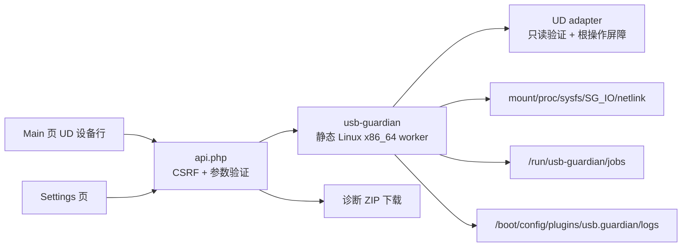
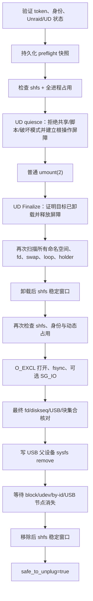

# 设计说明

## 目标与边界

目标是把物理拔盘变成一个可审计的事务：插件必须先证明目标身份稳定、所有用户已退出、文件系统已普通卸载、缓存已落盘、物理 USB 已从内核逻辑移除，并确认 `shfs` 没有在过程中失效，最后才授权用户拔盘。

这不是 `shfs/libfuse` 补丁。任何检查缺失、超时、版本未知或状态矛盾都按失败处理。

## 组件

- 网页只接收核心发现接口返回的 opaque target token。
- API 再次列出设备并比较 token，拒绝过期或伪造目标。
- 核心拥有最终判定权；前端按钮是静态操作入口，不表达资格或安全状态。设备列表、资格与占用检查只在用户点击后开始。
- 对已认证的 UD 2025.11.18，前端在 `updatePageContent()` 将 `data.disks` 写入 `#disk-table-body` 前用 DOM 解析器加入按钮，使按钮与 UD 行同帧渲染。若该内部入口不可用，则使用同步 DOM 观察器兜底；按钮采用固定预留槽和绝对定位，不参与表格列宽计算。
- 同一时间只允许一个弹出事务。
- 绿色提示还依赖服务端短期 lease；authority、终态任务、USB 缺席或内核设备清单任一变化都会撤销许可。

## 设备身份

目标身份包含：

- 根块设备名称和 major/minor；
- Linux `diskseq`；
- 物理 USB sysfs 路径；
- USB VID/PID、serial、busnum/devnum；
- 同一物理 USB 下的块设备集合；
- 独占块设备 fd 的 `fstat(st_rdev)`。

令牌使用本次启动的稳定 secret 签名。重启、重新枚举、设备替换或 `diskseq` 变化都会使旧令牌失效。缺少 `diskseq`、busnum/devnum、VID/PID 或最终身份集合不一致时禁止弹出。

## 资格判定

用户点击静态按钮后，界面会为不可弹出的设备显示原因弹窗。常见代码包括：

| 代码 | 含义 | 典型建议 |
|---|---|---|
| `protected_boot` | Unraid 启动盘/根设备 | 运行期间绝不能弹出 |
| `protected_array` / `protected_pool` | 阵列或池成员 | 只通过 Unraid 存储管理流程处理 |
| `open_files` | 进程仍有 fd/cwd/root/map 引用 | 正常关闭界面列出的进程或文件 |
| `docker_bind` | 容器命名空间或 USB fd | 停止对应容器或移除映射 |
| `vm_passthrough` | QEMU/libvirt 正在使用块设备或 `/dev/bus/usb` | 关闭 VM 或移除直通 |
| `smb_nfs_client` | 活动网络客户端 | 断开客户端后重新检查 |
| `swap_active` | 分区或挂载点上的 swapfile | 正常关闭 swap 配置 |
| `holder_active` | dm/md/LVM/RAID 等 holder | 使用所属存储工具停用 |
| `preclear_running` | Preclear 正在运行 | 正常停止或等待完成 |
| `composite_usb` / `multi_lun_usb` | 复合设备或多磁盘 USB 外置盒 | 当前版本不处理整个物理组合设备 |
| `unsupported_filesystem` | LUKS/ZFS/RAID/LVM 成员 | 先用所属工具 export/close/deactivate |
| `unsupported_mount_layout` | 同一 USB 有多个活动目标挂载 | 用 UD 普通卸载额外挂载后重试 |
| `unsupported_ud_version` | UD 版本/API 未认证 | 更新到已认证官方版本 |
| `ud_state_unsafe` | UD 正在操作，或目标启用了共享/脚本/破坏模式 | 按 detail 关闭对应配置并等待 UD 空闲 |
| `persistent_log_mount_*` | `/boot` 不是可验证的可写 FAT 闪存挂载 | 恢复启动闪存挂载后再试 |
| `shfs_unhealthy` | `fuse.shfs`、PID 或 I/O 异常 | 不要拔盘，先下载诊断并恢复 `/mnt/user` |
| `inspection_failed` | 任一关键状态无法证明 | 保持连接，查看 detail 和诊断包 |

所有建议都避免 force/lazy unmount 和自动 kill。

## 事务顺序

`safe_to_unplug` 只在最后一个状态写入。浏览器还要求任务状态为 `completed`，并每两秒向 API 续签一个五秒 fail-closed lease。API 在共享锁内核对最新 authority、受限普通任务文件、USB 原路径和 VID/PID/serial 缺席，并用 `/sys/kernel/uevent_seqnum` 包围 sysfs 扫描。仅有某个布尔字段或旧浏览器状态不能产生绿色许可。

## UD 集成

适配器仅认证官方 UD `2025.08.07` 和 `2025.11.18`。它会：

- 验证目标确实属于 UD，且没有 mounting/unmounting/formatting/clearing/preclear/pass-through 状态；
- 若目标分区启用了共享、UD Destructive Mode 已开启，或配置了磁盘、分区、用户、Common Script，则在检查阶段直接阻止操作，并要求用户先在 UD 中关闭和清理这些配置；
- 固化 major/minor、`diskseq`、物理 USB sysfs 路径、VID/PID、serial、busnum/devnum，并在每个入口重新验证；
- 只创建根设备的 `unmounting_<sdX>.state`，随后连续观察官方 `rc.unassigned` 进程、目标操作 marker、UD 拓扑和 mountinfo 的稳定窗口；
- 核心普通卸载完成后，确认所有目标 mount 已消失，再释放自己拥有且未超龄的根 marker。

适配器不会修改 SMB/NFS 配置，不运行任何 UD 设备脚本，不写 UD mounted JSON，也不调用 UD 的卸载入口。认证版本的这些路径缺少可证明的返回值或共享互斥，直接调用会重新引入竞态。真正的普通卸载只由核心执行；UD 页面若短暂显示旧状态，应由 UD/udev 自己刷新，Guardian 不代写全局状态。

## 失败与回滚

- UD 屏障已开始但尚未普通卸载：重新验证原 token 与完整 USB 身份，并在持久写入 `rollback_before` 后，用独立超时 context 只释放 Guardian 自己的根 marker；不恢复或修改任何用户配置。
- 普通卸载一旦成功就禁止 rollback；UD Finalize 紧跟卸载。USB 尚未 remove 时若后续失败，保持设备已卸载，不自动重新挂载；界面明确提示失败，可由用户正常重新挂载后重试。
- sysfs remove 已写入：绝不尝试把已移除硬件“回滚”回来，也绝不在后续验证失败时显示安全许可。
- 任意失败都会写结构化 reason、failure snapshot 和终态 timeline 记录。

## 持久化与恢复

每个事务在 flash 上创建 `active.json` 和追加式、逐条 `fsync` 的 `timeline.jsonl`。创建任何持久目录或锁之前，核心、API、启动脚本和适配器都要求 `/boot` 是唯一、可写、顶层块设备上的 FAT 启动挂载。快照使用临时文件、`fsync` 和原子 rename。恢复会核对 boot ID、worker PID/start ticks、原 token 和设备身份，只在同一次启动且可逆阶段尝试释放屏障，否则保留状态并要求保持设备连接。

运行状态放在 `/run`，只用于网页轮询；安全结论和取证不依赖它跨重启存在。

## 已知限制

- 尚无真实 Unraid 7.2.4 主机测试，UD DOM、根 marker 屏障时序和特定 USB bridge 行为仍需现场日志校正。
- Finalize 释放根 marker 到核心取得块设备 `O_EXCL` 独占句柄之间并非原子步骤，且中间包含健康与占用复核；取得独占句柄后，内核才阻止新的块设备打开。核心会重复检查 mount、占用和身份，但在没有 UD 提供跨进程正式锁 API 的前提下，Beta 不能把这一段描述成绝对互斥。弹出任务运行期间不得操作 UD 挂载按钮。
- 某些 USB-SATA bridge 不支持 SG_IO；该步骤失败会记录 warning，核心仍以 `fsync`、普通卸载和 USB remove 为基础。
- 物理断电或内核锁死可能早于最后一次 flash 落盘；因此仍必须配合持久/远程 syslog。
- 本版本主动拒绝复杂或多 LUN 设备、多个活动目标挂载，以及启用 UD Share/脚本/Destructive Mode 的目标，优先缩小风险面。
